# 🏓 Lobby Padel

A modern, full-featured web application for booking padel courts with comprehensive admin management capabilities. Built with Next.js 15 and designed with a mobile-first approach.

## 🚀 Live Demo

**🌐 [Visit Lobby Padel](https://final-project-fe-indra-nurfa.vercel.app/)**

## 📖 Project Description

Lobby Padel is a comprehensive padel court booking system that bridges the gap between players and court owners. The application provides an intuitive platform where players can easily discover, book, and manage their padel court reservations, while giving club and court owners powerful administrative tools to manage their facilities, bookings, and revenue.

**Target Audience:**

- 🏓 **Players**: Looking to book padel courts for recreational or competitive play
- 🏢 **Club Owners**: Managing multiple courts and facilities
- 👨‍💼 **Court Owners**: Individual court owners seeking booking management solutions

## ✨ Key Features

### 🔐 Authentication & Security

- Secure user registration and login system
- Role-based access control (User/Admin)
- Session management with NextAuth.js
- Protected routes and API endpoints

### 📱 User Experience

- **🌙 Dark Mode Support**: Toggle between light and dark themes
- **📱 Mobile-First Design**: Responsive design optimized for all devices
- **🔔 Toast Notifications**: Real-time feedback for user actions
- **⚡ Loading States**: Professional loading indicators throughout the app

### 🎾 Court Booking System

- Browse available padel courts
- Real-time availability checking
- Time slot selection with conflict prevention
- Booking confirmation and management
- Booking history and status tracking

### 👑 Admin Dashboard

- **📊 Analytics Dashboard**: Visual insights with interactive charts
- **📅 Booking Management**: View, confirm, and cancel bookings
- **🏟️ Court Management**: Add, edit, and manage court information
- **👥 User Management**: Monitor and manage registered users
- **💰 Revenue Tracking**: Monitor booking revenue and trends

### 💳 Pricing & Plans

- Flexible pricing tiers (ALPHA/BETA plans)
- Court type differentiation (Indoor/Outdoor)
- Transparent pricing display

## 🛠️ Tech Stack

### Frontend

- **⚛️ React 19.1.1** - Latest React with concurrent features
- **🔄 Next.js 15.3.5** - App Router, Server Components, SSR
- **🎨 TypeScript** - Type-safe development
- **🎭 Tailwind CSS** - Utility-first CSS framework
- **🎪 Shadcn/ui** - Beautiful, accessible component library

### UI Components & Libraries

- **📦 Radix UI** - Unstyled, accessible components
- **🎯 Lucide React** - Beautiful icon library
- **📊 Recharts** - Responsive chart library
- **🎪 Class Variance Authority** - Component variant management
- **🔧 React Hook Form** - Performant form handling

### State Management & Data Fetching

- **🌐 Axios** - HTTP client for API calls
- **🔐 NextAuth.js** - Authentication solution
- **🌗 next-themes** - Theme management

### Development Tools

- **⚡ Turbopack** - Fast bundler for development
- **📏 ESLint** - Code linting and quality
- **🎨 Prettier** - Code formatting

## 🚀 Installation Guide

### Prerequisites

- Node.js (Latest LTS version recommended)
- npm, yarn, or pnpm package manager
- Git

### Backend Setup

You have two options for the backend:

#### Option 1: Use Deployed Backend (Recommended)

The application is configured to work with our deployed backend at:

`https://final-project-be-indranurfa-production.up.railway.app`

#### Option 2: Run Backend Locally

1. Clone the backend repository:

```bash
git clone https://github.com/revou-fsse-feb25/final-project-be-IndraNurfa.git
cd final-project-be-IndraNurfa
```

2. Follow the backend setup instructions in its README.md

### Frontend Setup

1. **Clone the repository**

```bash
git clone https://github.com/revou-fsse-feb25/final-project-fe-IndraNurfa.git
cd final-project-fe-IndraNurfa
```

2. **Install dependencies**

```bash
npm install
# or
yarn install
# or
pnpm install
```

3. **Environment Configuration**

```bash
cp .env.example .env.local
```

Edit `.env.local` and configure the variables according to your needs:

```env
# Copy from .env.example and modify as needed
NEXTAUTH_URL=http://localhost:3000
NEXTAUTH_SECRET=your-secret-key
NEXT_PUBLIC_API_URL=your-backend-url
```

4. **Run the development server**

```bash
npm run dev
# or
yarn dev
# or
pnpm dev
```

5. **Open your browser**
   Navigate to [http://localhost:3000](http://localhost:3000) to see the application.

### Build for Production

```bash
npm run build
npm run start
```

## 📸 Application Screenshots

### 🏠 Public Pages


_Homepage - Welcome to Lobby Padel_

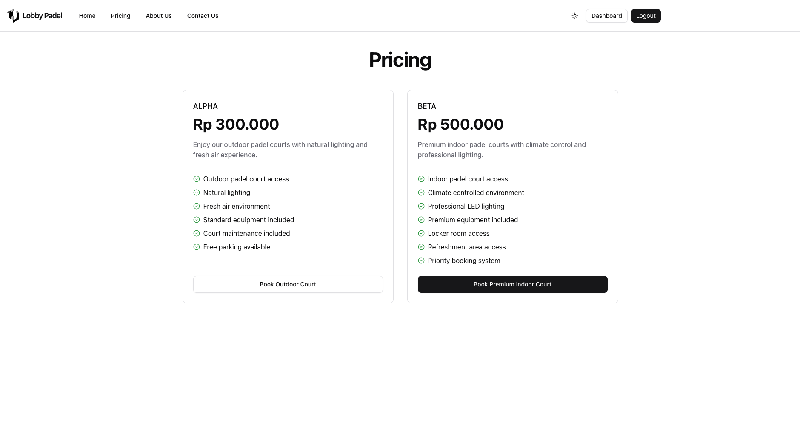
_Pricing - Explore our flexible pricing plans_

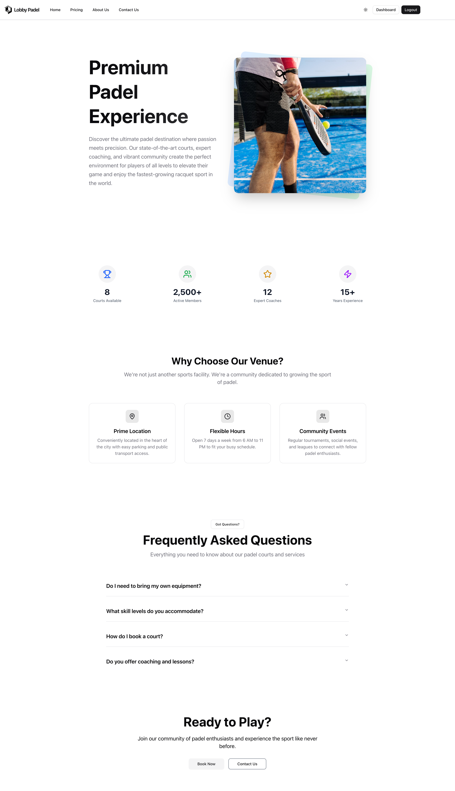
_About Us - Learn about our mission_

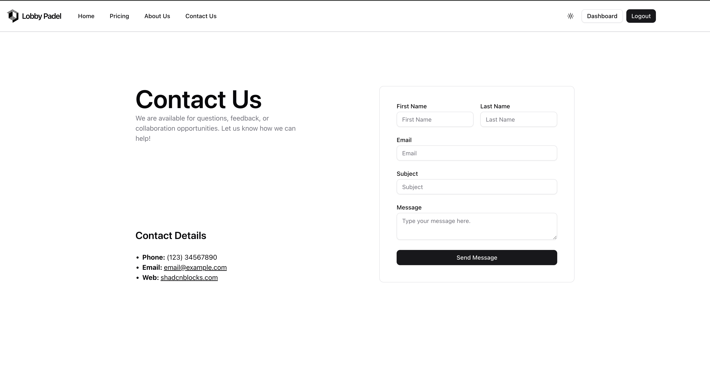
_Contact Us - Get in touch_

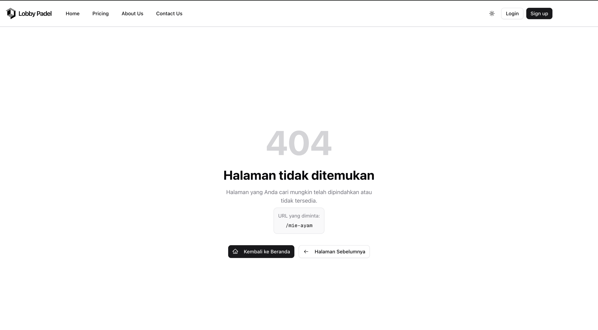
_404 Page - Custom error page_

### 🔐 Authentication

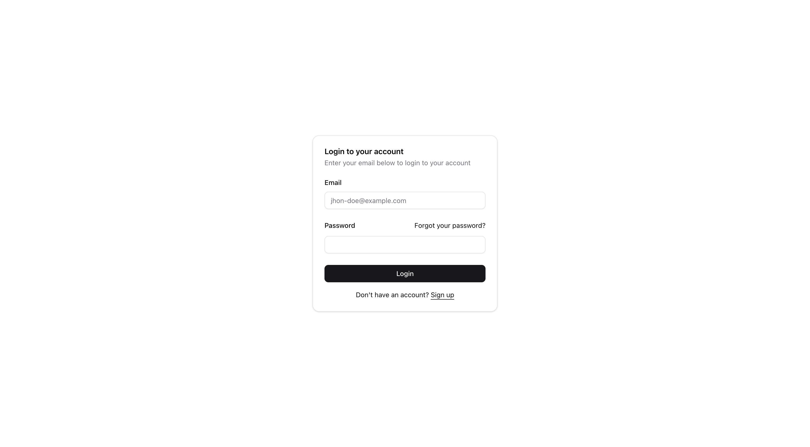
_Login Page - Secure user authentication_

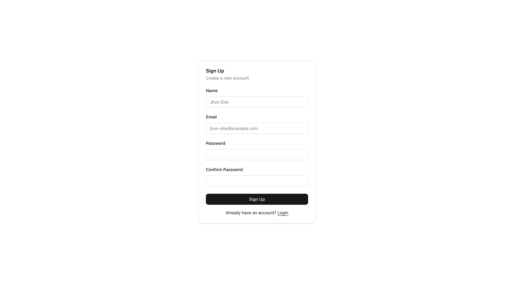
_Registration Page - Create new account_

### 👤 User Dashboard

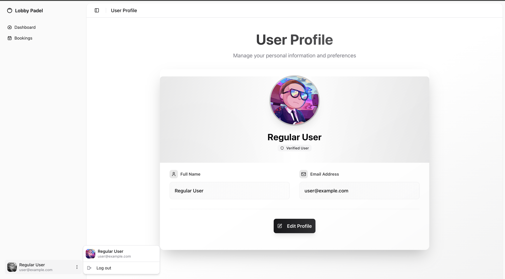
_User Dashboard - Personal booking overview_

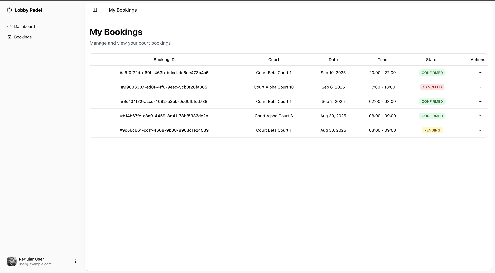
_User Booking - Browse and book courts_

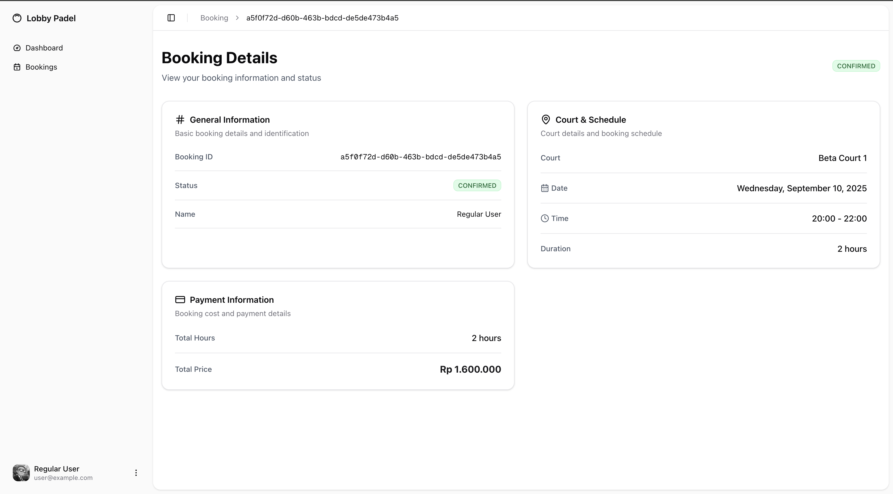
_User Booking Detail - Manage individual bookings_

### 👑 Admin Dashboard

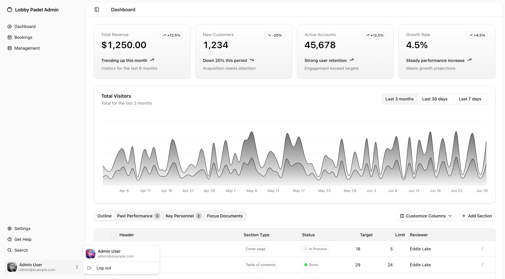
_Admin Dashboard - Analytics and insights_

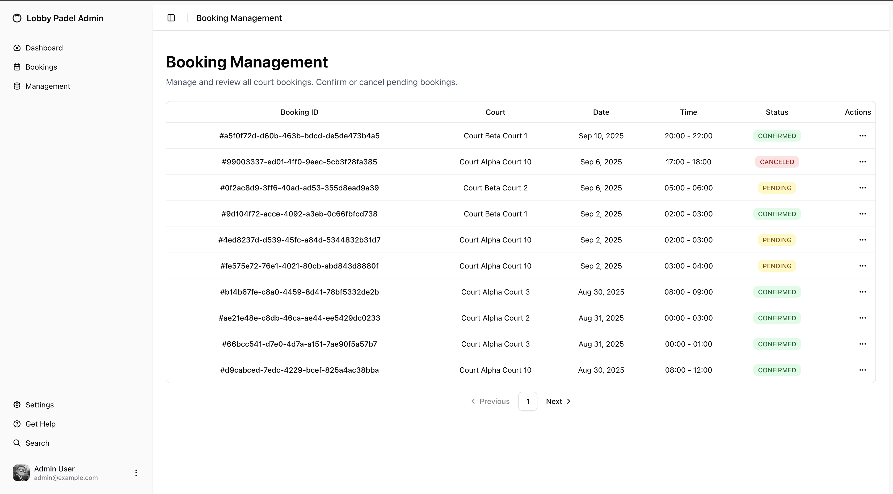
_Admin Booking Management - Manage all bookings_


_Admin Booking Detail - Detailed booking management_

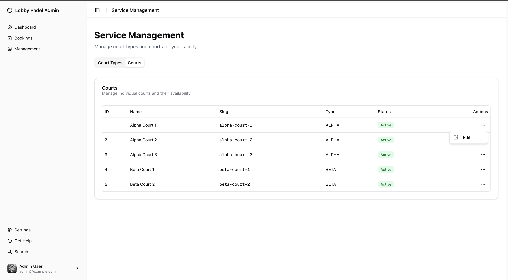
_Court Management - Manage court inventory_

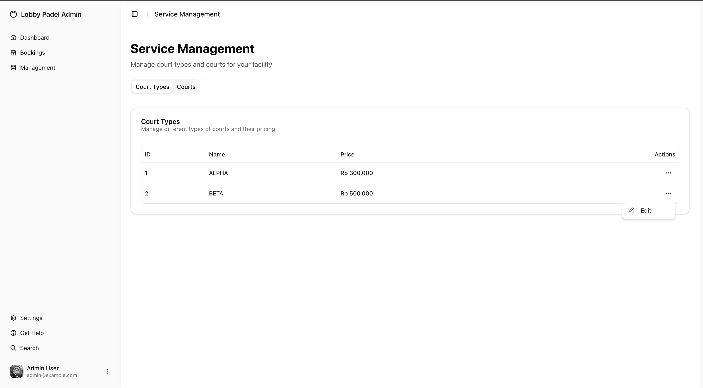
_Court Type Management - Configure court categories_

## 🚀 Deployment

The application is deployed on **Vercel** with automatic deployments from the main branch.

**Live URL**: [https://final-project-fe-indra-nurfa.vercel.app/](https://final-project-fe-indra-nurfa.vercel.app/)

### Deploy Your Own

[](https://vercel.com/new/clone?repository-url=https://github.com/revou-fsse-feb25/final-project-fe-IndraNurfa)

## 📝 License

This project is licensed under the MIT License.

---

<p align="right">GOD BLESS~ <br/>Indra Nurfa</p>
